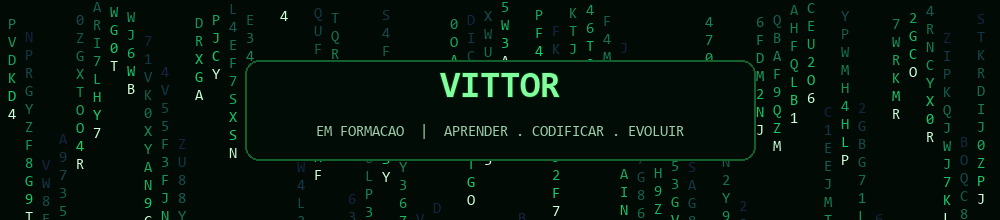

  

# Olá, eu sou Vittor 👋

### Desenvolvedor em formação | Aprendendo e construindo com código

Estudo programação com foco em **Python**, **MySQL** e boas práticas de desenvolvimento.
Este perfil reúne meus projetos, exercícios e aprendizados ao longo dessa jornada.

---

## Sobre mim

- 👨‍💻 Desenvolvedor em formação, sempre buscando aprender e praticar.
- 🐍 Estudando Python e fundamentos de programação.
- 🗄️ Explorando SQL e MySQL.

## Tecnologias

  
  

## Em destaque

📘 **[Meus estudos de Python — Curso em Vídeo](https://github.com/vittorguimaraes-git/cursoemvideo-python)**

Exercícios e anotações organizados por etapas do curso, acompanhando meu progresso em Python.

## Estatísticas do GitHub

  
  

## Atividade

  

---

  Obrigado pela visita! Fique à vontade para conhecer meus projetos. 🚀

